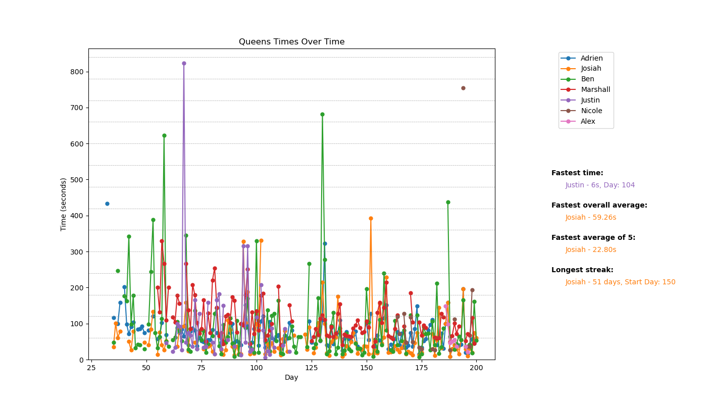

# LinkedIn Queens Grapher

This repository allows you to graph you and your friends' [LinkedIn Queens](https://www.linkedin.com/games/queens) performance, along with statistics like longest streaks and fastest average-of-5 times.

**Example output:**

<p align="center">
  
</p>

## Getting Started

### Installation

Make sure you have at least [Python 3.x](https://www.python.org/downloads/) installed.

1. **Clone the repository**:

```bash
git clone https://github.com/plettj/queens.git
cd queens
```

2. **Install required packages**:

Ensure you have the necessary packages installed.

```bash
pip install matplotlib pandas numpy
```

### Usage

1. **Prepare the Chat File**: Copy and paste the entire LinkedIn chat containing Queens times into the file in `data/` named `full-chat.txt`.

2. **Update Participant Names**: Open `chat-parser.py` and update the `sender_map` dictionary to match the names of the participants in your chat exactly as they appear.

3. **Run the Chat Parser**: This script will process the chat and produce a `queens-times.csv` file in `data/` with the relevant data.

```bash
python parse-chat.py
```

4. **Generate the Graph**: Use `graph.py` to create a dynamic graph of the Queens times over time, complete with statistics displayed alongside the graph.

```bash
python graph.py
```

## License

[MIT](LICENSE).
